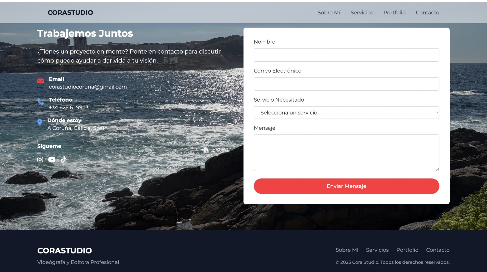

# CoraStudio.es — Videography & Creative Portfolio Site 🎬✨

This repository contains the full **front-end and back-end** implementation of [CoraStudio.es](http://corastudio.es) — a **bilingual videography portfolio and creative studio website** based in Galicia, Spain.

CoraStudio is led by Esther Cora, a filmmaker and content creator focused on lifestyle, storytelling, and visual media. The site showcases her work and services with a sleek, responsive layout and minimalist red/white/black color scheme.

  

---

## 🌐 Website Access

Live Site: **[www.corastudio.es](https://corastudio.es)**  
Hosted via **Heroku** for the frontend, with backend integrations for form handling and email routing.

---

## 🧩 Sections & Features

- **📸 Home:** Landing page with bold typography and hero message.
- **📖 Sobre mí / About:** Brief bilingual biography with profile photo.
- **🎞️ Portfolio:** Scrollable thumbnails linking to Esther's video and photo work.
- **📬 Contacto / Contact:** Email form connected to backend service.
- **🌐 Language Toggle:** Spanish/English switcher throughout site.

---

## 🎨 Assets Overview (Located in `/assets/`)

  

  

---

## 🚀 Tech Stack

- **Frontend:** HTML, TailwindCSS, JavaScript
- **Backend:** Python (Flask) / Node (depending on deployment context)
- **Deployment:** Heroku

---

## 📂 Folder Structure

